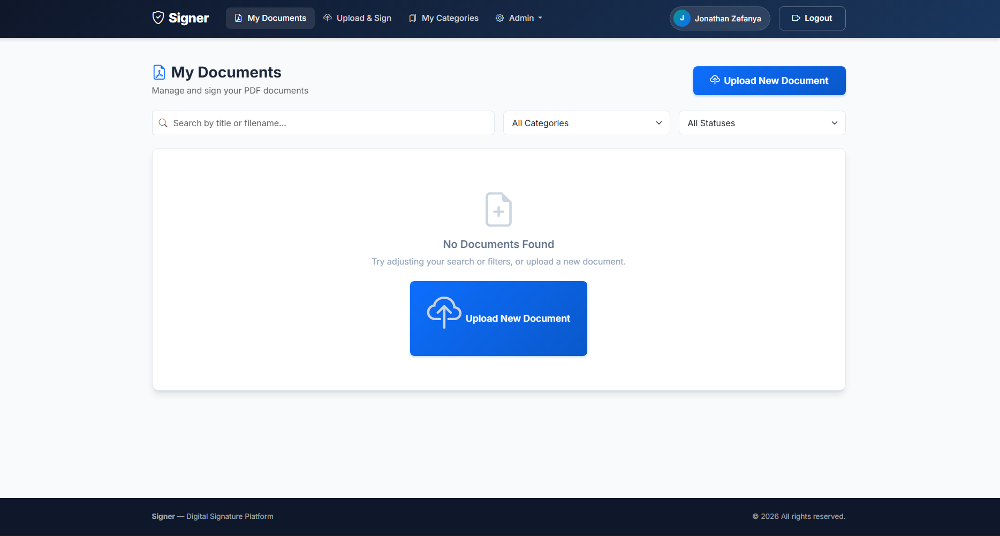

# DigiSign - Digital Document Signing Platform

DigiSign adalah platform manajemen dan penandatanganan dokumen digital berbasis web yang dibangun dengan **Laravel 12**. Aplikasi ini memungkinkan pengguna untuk mengunggah dokumen PDF, membubuhkan tanda tangan digital (QR Code), dan memverifikasi keaslian dokumen secara online.



## 🚀 Fitur Utama

### 🔐 Otentikasi & Keamanan
*   **User Role System**: Role Admin dan User biasa.
*   **SSO Integration**: Dukungan Single Sign-On (SSO) untuk integrasi dengan aplikasi eksternal.
*   **Secure Verification**: Halaman verifikasi publik untuk memeriksa keaslian dokumen melalui Hash SHA-256.

### 📄 Manajemen Dokumen
*   **Upload PDF**: Dukungan upload file PDF.
*   **Digital Signature**: Penandatanganan dokumen dengan QR Code yang berisi link verifikasi unik.
*   **QR Positioning**: Penempatan posisi QR Code yang presisi (Halaman, Koordinat X/Y).
*   **Document Categorization**: Pengelompokan dokumen berdasarkan kategori warna-warni.
*   **Download**: Unduh dokumen asli atau dokumen yang sudah ditandatangani.

### 🛠️ Fitur Admin
*   **Dashboard Statistik**: Ringkasan jumlah user, dokumen, dan aktivitas penandatanganan.
*   **User Management**: Tambah, edit, aktifkan/nonaktifkan, dan hapus user.
*   **Global Categories**: Pengaturan kategori dokumen sistem.
*   **App Settings**: Konfigurasi nama aplikasi, logo, timezone (Asia/Jakarta support), dan API Keys langsung dari dashboard.

## 📋 Persyaratan Sistem

Untuk menjalankan aplikasi ini, pastikan server Anda memenuhi persyaratan berikut:

*   **PHP**: ^8.2
*   **Composer**
*   **Node.js & NPM**
*   **Database**: MySQL / MariaDB
*   **Web Server**: Apache / Nginx
*   **PHP Extensions**: BCMath, Ctype, Fileinfo, JSON, Mbstring, OpenSSL, PDO, Tokenizer, XML.

## 📦 Instalasi

Ikuti langkah-langkah di bawah ini untuk menginstal proyek di local environment:

1.  **Clone Repository**
    ```bash
    git clone https://github.com/username/digisign.git
    cd digisign
    ```

2.  **Install PHP Dependencies**
    ```bash
    composer install
    ```

3.  **Install JavaScript Dependencies**
    ```bash
    npm install
    ```

4.  **Konfigurasi Environment**
    Salin file `.env.example` ke `.env`:
    ```bash
    cp .env.example .env
    ```
    Atur konfigurasi database di file `.env`:
    ```env
    DB_CONNECTION=mysql
    DB_HOST=127.0.0.1
    DB_PORT=3306
    DB_DATABASE=signer
    DB_USERNAME=root
    DB_PASSWORD=
    ```

5.  **Generate Application Key**
    ```bash
    php artisan key:generate
    ```

6.  **Setup Database (Migrate & Seed)**
    Jalankan migrasi dan seeder untuk membuat tabel dan user default:
    ```bash
    php artisan migrate --seed
    ```
    > **Catatan:** Seeder akan membuat akun Admin dan User demo secara otomatis.

7.  **Link Storage**
    Agar file upload bisa diakses publik (logo, avatar, dll):
    ```bash
    php artisan storage:link
    ```

8.  **Jalankan Aplikasi**
    Buka dua terminal terpisah untuk menjalankan server Laravel dan Vite (frontend build):
    
    *Terminal 1:*
    ```bash
    php artisan serve
    ```
    
    *Terminal 2:*
    ```bash
    npm run dev
    ```

    Akses aplikasi di `http://localhost:8000`.

## 👤 Akun Demo Default

Jika Anda menjalankan `php artisan migrate --seed`, Anda dapat menggunakan akun berikut untuk login:

| Role | Email | Password |
|------|-------|----------|
| **Administrator** | `admin@digisign.local` | `password` |
| **User** | `user@digisign.local` | `password` |

## ⚙️ Konfigurasi Lanjutan

### Pengaturan Timezone
Aplikasi mendukung pengaturan timezone dinamis. Secara default timezone adalah `UTC`. Untuk mengubahnya ke Waktu Indonesia Barat (WIB):
1. Login sebagai **Admin**.
2. Masuk ke menu **Settings**.
3. Ubah **App Timezone** menjadi `Asia/Jakarta`.

### SSO Integration
Untuk mengaktifkan fitur Single Sign-On:
1. Buka `.env` atau menu **Settings** di Admin Panel.
2. Isi `SSO_API_URL` dan `SSO_API_KEY`.
3. Endpoint API tersedia di:
   - `GET /sso/autologin`
   - `POST /admin-api/sso/login`

## 🤝 Berkontribusi

Kontribusi selalu diterima! Silakan buat **Pull Request** untuk perbaikan bug atau fitur baru.

1.  Fork repository ini.
2.  Buat branch fitur baru (`git checkout -b fitur-keren`).
3.  Commit perubahan Anda (`git commit -m 'Menambahkan fitur keren'`).
4.  Push ke branch (`git push origin fitur-keren`).
5.  Buat Pull Request.

## 📝 Lisensi

Aplikasi ini bersifat open-source di bawah lisensi [MIT](https://opensource.org/licenses/MIT).
